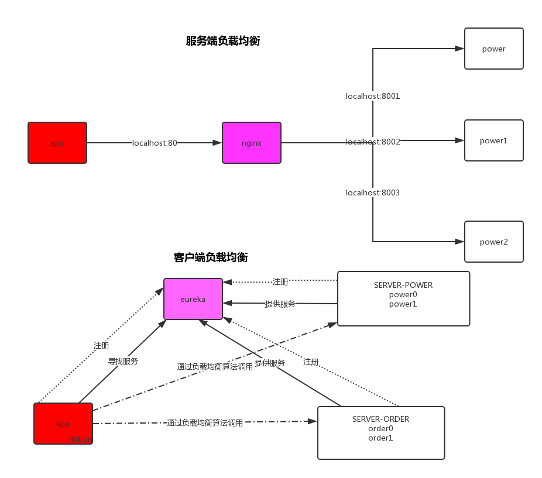

# 微服务架构：Spring-Cloud


## 一、微服务入门

###  什么是微服务？

 微服务就是把原本臃肿的一个项目的所有模块拆分开来并做到互相没有关联，甚至可以不使用同一个数据库。  比

如：项目里面有User模块和Power模块，但是User模块和Power模块并没有直接关系，仅仅只是一些数据需要交

互，那么就可以吧这2个模块单独分开来，当user需要调用power的时候，power是一个服务方，但是power需要

调用user的时候，user又是服务方了， 所以，他们并不在乎谁是服务方谁是调用方，他们都是2个独立的服务，这

时候，微服务的概念就出来了。

### 经典问题:微服务和分布式的区别

 谈到区别，我们先简单说一下分布式是什么，所谓分布式，就是将偌大的系统划分为多个模块（这一点和微服务

很像）部署到不同机器上（因为一台机器可能承受不了这么大的压力或者说一台非常好的服务器的成本可能够好几

台普通的了），各个模块通过接口进行数据交互，其实 分布式也是一种微服务。 因为都是吧模块拆分开来变为独

立的单元，提供接口来调用，那么 他们本质的区别在哪呢？ 他们的区别主要体现在“目标”上， 何为目标，就是你

这样架构项目要做到的事情。 分布式的目标是什么？ 我们刚刚也看见了， 就是一台机器承受不了的，或者是成本

问题 ， 不得不使用多台机器来完成服务的部署， 而微服务的目标 只是让各个模块拆分开来，不会被互相影响，

比如模块的升级亦或是出现BUG等等... 

讲了这么多，可以用一句话来理解：分布式也是微服务的一种，而微服务他可以是在一台机器上。

### 微服务与Spring-Cloud的关系（区别）

微服务只是一种项目的架构方式，或者说是一种概念，就如同我们的MVC架构一样， 那么Spring-Cloud便是对这

种技术的实现。

### 微服务一定要使用Spring-Cloud吗？

我们刚刚说过，微服务只是一种项目的架构方式，如果你足够了解微服务是什么概念你就会知道，其实微服务就算

不借助任何技术也能实现，只是有很多问题需要我们解决罢了例如：负载均衡，服务的注册与发现，服务调用，路

由。。。。等等等等一系列问题，所以,Spring-Cloud 就出来了，Spring-Cloud将处理这些问题的的技术全部打包

好了，就类似那种开袋即食的感觉。。

### 自己实现微服务

详细请查看源码 lx-spring-cloud


### 	微服务要面临的问题

- 监听服务有没有宕机
- 负载均衡
- 熔断
- 限流
- 降级
- 网关，路由，过滤
- 服务注册与发现

单体应用不会出现上面的问题，

开发成本太大---> Spring Cloud出现

- 负载均衡                    nginx    ribbon
- 熔断、限流、降级     hystrix               
- 网关，路由，过滤    zuul
- 服务注册与发现     eureka   zookeeper


### Spring-Cloud项目的搭建注意事项

 因为spring-cloud是基于spring-boot项目来的，所以我们项目必须是一个spring-boot项目，这里要注意的一个点

是spring-cloud的版本与spring-boot的版本要对应下图（www.spring.io）：


springboot依赖

```xml
<parent>
    <groupId>org.springframework.boot</groupId>
    <artifactId>spring-boot-starter-parent</artifactId>
    <version>2.0.7.RELEASE</version>
</parent>
```

SpringCloud依赖

```xml
<dependency>
    <groupId>org.springframework.cloud</groupId>
    <artifactId>spring-cloud-dependencies</artifactId>
    <version>Finchley.SR2</version>
</dependency>
```


## 二、Spring Cloud组件-Eureka

### Eureka是什么？

Eureka是Netflix的子模块之一，也是一个核心的模块，eureka里有2个组件，一个是EurekaServer(一个独立的项

目) 这个是用于定位服务以实现中间层服务器的负载平衡和故障转移，另一个便是EurekaClient（我们的微服务） 

它是用于与Server交互的，可以使得交互变得非常简单:只需要通过服务标识符即可拿到服务。

### 与Spring-cloud的关系

Spring Cloud 封装了 Netflix 公司开发的 Eureka 模块来实现服务注册和发现(可以对比Zookeeper)。

Eureka 采用了 C-S 的设计架构。Eureka Server 作为服务注册功能的服务器，它是服务注册中心。

而系统中的其他微服务，使用 Eureka 的客户端连接到 Eureka Server并维持心跳连接。这样系统的维护人员就可

以通过 Eureka Server 来监控系统中各个微服务是否正常运行。SpringCloud 的一些其他模块（比如Zuul）就可以

通过 Eureka Server 来发现系统中的其他微服务，并执行相关的逻辑。

### 角色关系图


### Eureka结构图


上图是官网给的基于集群部署的 Eureka 架构图，先看一下图上各个部件的表示含义以及它们之间的交互：

- Eureka Server：Eureka 服务端，多个 Eureka Server 可构成集群，集群中各节点完全对等。
- Eureka Client：Eureka 客户端，业务服务依赖它实现服务注册和服务发现功能。
- Application Service：服务提供者，依赖 Eureka Client 实现服务注册功能。
- Application Client：服务消费者，依赖 Eureka Client 实现服务发现功能。
- Register：Eureka Client 启动时会发起 Register 请求向 Eureka Server 注册自己。
- Renew：Eureka Client 会周期性的向 Eureka Server 发送心跳来续约，默认30s。
- Cancel：Eureka Client 关闭时会发送 Cancel 下线请求。
- Get：Eureka Client 会周期性的发送 Get 请求，从 Eureka Server 获取注册表信息，默认30s。
- Make Remote Call：服务消费者通过 Make Remote Call 访问服务提供者。
- Replicate：Eureka Server 之间通过 Replicate 实现数据同步。当 Eureka Client 有请求（Heartbeat, Register, Cancel, StatusUpdate, DeleteStatusOverride）到某一个 Eureka Server 节点，该节点完成自身对应的操作后，会通过 Replicate 将本次请求同步到其他节点。

### 注意事项

**【注】**spring-cloud-starter-eureka-server依赖与spring-cloud-starter-netflix-eureka-server的区别


springcloud更新换代比较快，可能1.5可以使用，到了2.0就不用了。所以做项目或者练习时要看清自己使用的版

本。1.5版本使用spring-cloud-starter-eureka-server还是没问题的。2.0以上建议使用 spring-cloud-starter-

netflix-eureka-server。

官网说明：https://spring.io/projects/spring-cloud-netflix


### 代码实战

**详细请查询lx-spring-cloud下eureka3000模块**

### Eureka可视化界面详解


#### Home

```
【System Status】
Environment : 环境，默认为test， 该参数在实际使用过程中，可以不用更改
Data center ： 数据中心，使用的是默认的是 “MyOwn”
Current time：当前的系统时间
Uptime ： 已经运行了多少时间
Lease expiration enabled ：是否启用租约过期 ， 自我保护机制关闭时，该值默认是true， 自我保护机制开启之后为false。
Renews threshold ： 每分钟最少续约数
Renews (last min) ： 最后一分钟的续约数量（不含当前，1分钟更新一次）

【DS Replicas】
这里表示这个地址是这个Eureka Server相邻节点，互为一个集群

【Instances currently registered with Eureka】
表示各个微服务注册到这个服务上的实例信息

【General Info】
total-avail-memory : 总共可用的内存
environment : 环境名称，默认test
num-of-cpus : CPU的个数
current-memory-usage : 当前已经使用内存的百分比
server-uptime : 服务启动时间
registered-replicas : 相邻集群复制节点
unavailable-replicas ：不可用的集群复制节点，如何确定不可用？ 主要是server1 向 server2和server3 发送接口查询自身的注册信息，
如果查询不到，则默认为不可用 ， 也就是说如果Eureka Server自身不作为客户端注册到上面去，则相邻节点都会显示为不可用。
available-replicas ：可用的相邻集群复制节点
```

#### Last 1000 since startup

- Last 1000 cancelled leases（最后1000个取消的租约）
- Last 1000 newly registered leases（最后1000个新注册的租约）

### 配置文件说明

#### Eureka自我保护机制

```yml
eureka:
  server:
    enable-self-preservation:   #自我保护机制配置
```

默认情况下，如果Eureka Server在一定时间内（默认90秒）没有接收到某个微服务实例的心跳，Eureka Server

将会移除该实例。但是当网络分区故障发生时，微服务与Eureka Server之间无法正常通信，而微服务本身是正常

运行的，此时不应该移除这个微服务，所以引入了自我保护机制。

- 自我保护模式正是一种针对网络异常波动的安全保护措施，使用自我保护模式能使Eureka集群更加的健壮、稳定的运行。

- 自我保护机制的工作机制是如果在15分钟内超过85%的客户端节点都没有正常的心跳，那么Eureka就认为客户端与注册中心出现了网络故障，Eureka Server自动进入自我保护机制

**【注意】**该保护机制的目的是避免网络连接故障，在发生网络故障时，微服务和注册中心之间无法正常通

信，但服务本身是健康的，不应该注销该服务。 如果eureka因网络故障而把微服务误删了，那即使网络恢复了，

该微服务也不会重新注册到eureka server了，因为只有在微服务启动的时候才会发起注册请求，后面只会发送心

跳和服务列表请求，这样的话，该实例虽然是运行着，但永远不会被其它服务所感知。 所以，eureka server在短

时间内丢失过多的客户端心跳时，会进入自我保护模式，该模式下，eureka会保护注册表中的信息，不在注销任

何微服务，当网络故障恢复后，eureka会自动退出保护模式。自我保护模式可以让集群更加健壮。

但是我们在开发测试阶段，需要频繁地重启发布，如果触发了保护机制，则旧的服务实例没有被删除，这时请求有

可能跑到旧的实例中，而该实例已经关闭了，这就导致请求错误，影响开发测试。所以，在开发测试阶段，我们可

以把自我保护模式关闭，只需在eureka server配置文件中加上如下配置即可：

```
eureka:
  server:
    enable-self-preservation: false  #关闭自我保护机制
```

但在生产环境，不会频繁重启，所以，一定要把自我保护机制打开，否则网络一旦终端，就无法恢复。

#### Eureka缓存机制

**注册表的存储结构 AbstractInstanceRegistry.java**

```java
private final ConcurrentHashMap<String, Map<String, Lease<InstanceInfo>>> registry = new ConcurrentHashMap();

@Override
public synchronized void initializedResponseCache() {
    if (responseCache == null) {
        responseCache = new ResponseCacheImpl(serverConfig, serverCodecs, this);
    }
}
```

先来看一下注册表的存储结构，上图 ConcurrentHashMap<String, Map<String, Lease>> register 就是注册表。

ConcurrentHashMap 的 key 存储的是服务名称，value 的这个 Map 存储的是该服务对应的多个实例信息，Map 

的 key 存储的是服务实例的id，value 的 Lease 就是实例信息，InstanceInfo 就代表了服务实例的具体信息，比如

机器的ip地址、hostname 以及端口号，Lease 可以理解为 InstanceInfo 的包装类，维护了服务实例的一些动态

数据，比如最近的心跳时间。另外，从源码中可以看到，register 是完全基于内存的，服务的注册、下线、故障，

全部会在内存里维护和更新这个注册表。

**缓存配置类 ResponseCacheImpl.java**

```java
private final LoadingCache<Key, Value> readWriteCacheMap;


public void invalidate(Key... keys) {
    for (Key key : keys) {
        logger.debug("Invalidating the response cache key : {} {} {} {}, {}",
                key.getEntityType(), key.getName(), key.getVersion(), key.getType(), key.getEurekaAccept());

        readWriteCacheMap.invalidate(key);
        Collection<Key> keysWithRegions = regionSpecificKeys.get(key);
        if (null != keysWithRegions && !keysWithRegions.isEmpty()) {
            for (Key keysWithRegion : keysWithRegions) {
                logger.debug("Invalidating the response cache key : {} {} {} {} {}",
                        key.getEntityType(), key.getName(), key.getVersion(), key.getType(), key.getEurekaAccept());
                readWriteCacheMap.invalidate(keysWithRegion);
            }
        }
    }
}
```


Eureka Server存在三个变量：(**registry、readWriteCacheMap、readOnlyCacheMap**)保存服务注册信息，默

认情况下定时任务每30s将readWriteCacheMap同步至readOnlyCacheMap，每60s清理超过90s未续约的节点，

Eureka Client每30s从readOnlyCacheMap更新服务注册信息，而UI则从registry更新服务注册信息。

- 注册：
  - Eureka Client 发起 Register 请求。
  - Eureka Server 将 Eureka Client 信息添加到注册表，同时使 ReadWriteCacheMap 缓存失效。
  - 一段时间后（默认30s），Eureka Server 的后台线程发现 ReadWriteCacheMap 被清空了，就会清空 ReadOnlyCacheMap 缓存。
- 获取注册表：
  - Eureka Client 发起Get请求。
  - 首先，从 ReadOnlyCacheMap 缓存查询，有就返回。
  - 如果没有，从 ReadWriteCacheMap 缓存查询，有就返回。
  - 如果还没有，就查询内存中的注册表，同时将结果填充到 ReadWriteCacheMap 缓存和 ReadOnlyCacheMap 缓存。

　　这就是 Eureka Server 端的缓存机制，通过 ReadWriteCacheMap 缓存和 ReadOnlyCacheMap 缓存减少了注册表的读写冲突，起到了类似于读写分离的效果，进一步保证了 Eureka 的性能。

　　同时 Eureka Client 端也缓存了一份注册表信息，周期性的从 Eureka Server 拉取最新的数据。

**三级缓存**

| 缓存                | 类型                     | 说明                                                         |
| ------------------- | ------------------------ | ------------------------------------------------------------ |
| *registry*          | ConcurrentHashMap        | **实时更新**，类AbstractInstanceRegistry成员变量，UI端请求的是这里的服务注册信息 |
| *readWriteCacheMap* | Guava Cache/LoadingCache | **实时更新**，类ResponseCacheImpl成员变量，缓存时间180秒     |
| *readOnlyCacheMap*  | ConcurrentHashMap        | **周期更新**，类ResponseCacheImpl成员变量，默认每**30s**从readWriteCacheMap更新，Eureka client默认从这里更新服务注册信息，可配置直接从readWriteCacheMap更新 |

**缓存相关配置**

| 配置                                               | 默认  | 说明                                                         |
| -------------------------------------------------- | ----- | ------------------------------------------------------------ |
| `eureka.server.useReadOnlyResponseCache`           | true  | Client从**readOnlyCacheMap**更新数据，false则跳过readOnlyCacheMap直接从readWriteCacheMap更新 |
| `eureka.server.responsecCacheUpdateIntervalMs`     | 30000 | readWriteCacheMap更新至readOnlyCacheMap周期，默认**30s**     |
| `eureka.server.evictionIntervalTimerInMs`          | 60000 | 清理未续约节点(evict)周期，默认**60s**                       |
| `eureka.instance.leaseExpirationDurationInSeconds` | 90    | 清理未续约节点超时时间，默认**90s**                          |

### eureka对比Zookeeper

> CAP 不在详细讲解
>
> Consistency  ---一致性
> Availability  ---可用性
> Partition tolerance ---分区容错性
>
> 一致性与可用性互斥，不能同时实现。

 Zookeeper在设计的时候遵循的是CP原则，即一致性,Zookeeper会出现这样一种情况，当master节点因为网络故障与其他节点失去联系时剩余节点会重新进行leader选举，问题在于，选举leader的时间太长：30~120s，且选举期间整个Zookeeper集群是不可用的，这就导致在选举期间注册服务处于瘫痪状态，在云部署的环境下，因网络环境使Zookeeper集群失去master节点是较大概率发生的事情，虽然服务能够最终恢复，但是漫长的选举时间导致长期的服务注册不可用是不能容忍的。

 Eureka在设计的时候遵循的是AP原则，即可用性。Eureka各个节点（服务)是平等的， 没有主从之分，几个节点down掉不会影响正常工作，剩余的节点（服务） 依然可以提供注册与查询服务，而Eureka的客户端在向某个Eureka注册或发现连接失败，则会自动切换到其他节点，也就是说，只要有一台Eureka还在，就能注册可用（保证可用性）， 只不过查询到的信息不是最新的（不保证强一致），除此之外，Eureka还有自我保护机制，如果在15分钟内超过85%节点都没有正常心跳，那么eureka就认为客户端与注册中心出现了网络故障，此时会出现一下情况:

1：Eureka 不再从注册列表中移除因为长时间没有收到心跳而过期的服务。

2：Eureka 仍然能够接收新服务的注册和查询请求，但是不会被同步到其它节点上（即保证当前节点可用）

3：当网络稳定后，当前实例新的注册信息会被同步到其它节点中

## 三、Spring Cloud组件 - Ribbon

### Ribbon是什么?

 Spring Cloud Ribbon是基于Netflix Ribbon实现的一套客户端负载均衡的工具。

简单的说，Ribbon是Netflix发布的开源项目，主要功能是提供客户端的软件负载均衡算法，将Netflix的中间层服务连接在一起。Ribbon客户端组件提供一系列完善的配置项如连接超时，重试等。简单的说，就是在配置文件中列出Load Balancer（简称LB）后面所有的机器，Ribbon会自动的帮助你基于某种规则（如简单轮询，随机连接等）去连接这些机器。我们也很容易使用Ribbon实现自定义的负载均衡算法。

### 客户端负载均衡和服务端负载均衡区别

Nginx是服务器负载均衡，客户端多有请求都交给nginx，然后由nginx实现转发请求，及负载均衡有服务器端实现。

Ribbon本地负载均衡，在调用微服务接口时候，会在注册中心上获取注册信息服务列表之后缓存到本地JVM本地，从而在本地实现RPC远程服务调用技术。



### 代码实战

详细请查看源码

官方警告：

>  The `CustomConfiguration` class must be a `@Configuration` class, but take care that it is not in a `@ComponentScan` for the main application context. Otherwise, it is shared by all the `@RibbonClients`. If you use `@ComponentScan` (or `@SpringBootApplication`), you need to take steps to avoid it being included (for instance, you can put it in a separate, non-overlapping package or specify the packages to scan explicitly in the `@ComponentScan`).

**【译】**CustomConfiguration类必须是@Configuration类，但是要注意它不在主应用程序上下文的@ComponentScan中。否则，它将被所有@RibbonClients共享。如果您使用@ComponentScan(或@SpringBootApplication)，您需要采取步骤来避免包含它(例如，您可以将它放在一个单独的、不重叠的包中，或者在@ComponentScan中明确指定要扫描的包)。

例子：项目有三个模块，user、order（2台负载）、payment（2台负载）模块，user要调用order模块和payment模块，但是要求order和payment的负载均衡算法不一致。因为需要单独创建两个config。不能放置到@ComponentScan能够扫描的地方。

### 核心组件：IRule

IRule是什么? 它是Ribbon对于负载均衡策略实现的接口， 怎么理解这句话？ 说白了就是你实现这个接口，就能自定义负载均衡策略， 自定义我们待会儿来讲， 我们先来看看他有哪些默认的实现


## 四、Spring Cloud组件 - Open Feign

### Feign是什么 

 Feign是一个声明式WebService客户端。使用Feign能让编写Web Service客户端更加简单, 它的使用方法是定义一个接口，然后在上面添加注解，同时也支持JAX-RS标准的注解。Feign也支持可拔插式的编码器和解码器。Spring Cloud对Feign进行了封装，使其支持了Spring MVC标准注解和HttpMessageConverters。Feign可以与Eureka和Ribbon组合使用以支持负载均衡。

### Feign 能干什么

Feign旨在使编写Java Http客户端变得更容易。 

前面在使用Ribbon+RestTemplate时，利用RestTemplate对http请求的封装处理，形成了一套模版化的调用方法。但是在实际开发中，由于对服务依赖的调用可能不止一处，往往一个接口会被多处调用，所以通常都会针对每个微服务自行封装一些客户端类来包装这些依赖服务的调用。所以，Feign在此基础上做了进一步封装，由他来帮助我们定义和实现依赖服务接口的定义。在Feign的实现下，我们只需创建一个接口并使用注解的方式来配置它(以前是Dao接口上面标注Mapper注解,现在是一个微服务接口上面标注一个Feign注解即可)，即可完成对服务提供方的接口绑定，简化了使用Spring cloud Ribbon时，自动封装服务调用客户端的开发量。

### Feign集成Ribbon

利用Ribbon维护了order的服务列表信息，并且通过轮询实现了客户端的负载均衡，而不与Ribbon不同的是，通过feign只需要定义服务绑定接口且以声明式的方法，优雅简单的实现了服务调用。

### 代码实战

- 连接超时时间（OpenFeign默认等待时间为1s，超时报错）

  ```yml
  ribbon:
    ReadTimeout: 10000   #负载均衡超时时间，默认值5000
    ConnectTimeout: 4000 #ribbon请求连接的超时时间，默认值2000
  ```

- 负载均衡策略配置

  ```yml
  # feign和ribbon结合，指定策略。feign默认的是轮询的策略，这里的配置可以自定义
  # FEIGN-PAYMENT 为服务名称
  FEIGN-PAYMENT:
    ribbon:
      NFLoadBalancerRuleClassName: com.netflix.loadbalancer.RandomRule
  ```

### Feign日志级别

- NONE：默认的，不显示任何日志
- BASIC：仅记录请求方法、URL、响应状态码及执行时间
- HEADERS：除了BASIC定义的信息外，还有请求的响应头信息；
- FULL：除了HEADERS中定义的信息外，还有请求和响应的正文以及元数据

## 五、Spring Cloud组件 - Hystrix

### hystrix是什么？

 Hystrix是一个用于处理分布式系统的延迟和容错的开源库，在分布式系统里，许多依赖不可避免的会调用失败，比如超时、异常等，Hystrix能够保证在一个依赖出问题的情况下，不会导致整体服务失败，避免级联故障，以提高分布式系统的弹性。

“断路器”本身是一种开关装置，当某个服务单元发生故障之后，通过断路器的故障监控（类似熔断保险丝），向调用方返回一个符合预期的、可处理的备选响应（FallBack），而不是长时间的等待或者抛出调用方无法处理的异常，这样就保证了服务调用方的线程不会被长时间、不必要地占用，从而避免了故障在分布式系统中的蔓延，乃至雪崩。

### 降级，超时 

 我们先来解释一下降级,降级是当我们的某个微服务响应时间过长，或者不可用了，讲白了也就是那个微服务调用不了了，我们不能把错误信息返回出来，或者让他一直卡在那里，所以要在准备一个对应的策略（一个方法）当发生这种问题的时候我们直接调用这个方法来快速返回这个请求，不让他一直卡在那 。

### 停更维护

https://github.com/Netflix/Hystrix

> Hystrix is no longer in active development, and is currently in maintenance mode.

### 服务降级（fallback）

- 程序运行异常
- 超时
- 服务熔断触发服务降级
- 线程池/信号量打满也会导致降级

**解决**

- 被调用服务超时了，调用者不能一直卡死等待，必须有服务降级
- 被调用服务down机了，调用者不能一直卡死等待，必须有服务降级。
- 被调用服务OK，调用者自己出故障或有自我要求（自己的等待时间小于服务提供者），自己服务降级。

### 服务熔断（break）

- 断路器 （保险丝）
- 熔断机制概述：熔断机制是应对雪崩效应的一种微服务链路保护机制，当扇出链路的某个微服务出错不可用或者响应时间太长，会产生服务降级。进而熔断该节点微服务调用，快速返回错误响应信息。当检测到该节点微服务调用响应正常后，**恢复调用链路**
- 在Spring Cloud框架中。熔断机制通过Hystrix实现，Hystrix会监控微服务间调用的状况，当失败的调用到一定阈值，缺省值5秒内20次调用失败，就会启动熔断机制，熔断机制的注解是@HystrixCommand

服务降级提倡者：https://martinfowler.com/bliki/CircuitBreaker.html

**熔断状态**

- 熔断打开：请求不在进行调用当前服务，内部设置时钟一般为MTTR（平均故障时间），当打开时长达到所设时钟则进入半熔断状态
- 熔断关闭：熔断关闭不会对服务进行熔断
- 熔断半开：部分请求根据规则调用当前服务，如果请求成功且符合规则认为当前服务恢复正常，关闭熔断


熔断在什么情况下开始起作用


1. 当满足一定的阀值的时候（默认10秒超过20个请求次数）
2. 当失败率达到一定的时候（默认10秒内超过50%的请求失败）
3. 到达以上阀值，断路器将会开启
4. 当开启的时候，所有的请求不会再进行转发
5. 一般时间后（默认5秒），这个时候断路器是半开状态，会让其中一个请求进行转发，如果成功，断路器会关闭，如果失败，继续开启，重复4和5

hystrix所有配置参数详解：https://blog.csdn.net/tongtong_use/article/details/78611225

### 服务限流（flowlimit）


### 实时化监控

hystrix可以搭建可视化界面

```xml
<dependency>
    <groupId>org.springframework.cloud</groupId>
    <artifactId>spring-cloud-starter-netflix-hystrix-dashboard</artifactId>
</dependency>
```

启动类上增加

```java
@EnableHystrixDashboard
```

Spring Cloud F版后需要配置Bean

```java
@Bean
public ServletRegistrationBean getServlet(){
    HystrixMetricsStreamServlet hystrixMetricsStreamServlet = new HystrixMetricsStreamServlet();
    ServletRegistrationBean servletRegistrationBean = new ServletRegistrationBean(hystrixMetricsStreamServlet);
    servletRegistrationBean.setLoadOnStartup(1);
    servletRegistrationBean.addUrlMappings("/hystrix.stream");
    servletRegistrationBean.setName("HystrixMetricsStreamServlet");
    return servletRegistrationBean;
}
```

七色、一圈、一线

## 六、Spring Cloud组件 - Gateway

### 是什么

Cloud 全家桶中有个很重要的组件就是网关，在1.X版本中都是采用zuul网关，但是在2.X中，zuul网关升级出现分歧。Spring Cloud最后自己研发了一个网关代替zuul。

SpringCloud Gateway（亲儿子）是Spring Cloud的一个全新项目,基于Spring 5.0+Spring Boot 2.0和Project Reactor等技术开发的网关,它旨在为微服务架构提供一种简单有效的统一的API路由管理方式。

SpringCloud Gateway作为Spring Cloud生态系统中的网关,目标是替代Zuul,在Spring Cloud 2.0以上版本中,没有对新版本的Zuul 2.0以上最新高性能版本进行集成,仍然还是使用的Zuul 1.x非Reactor模式的老版本。而为了提升网关的性能, SpringCloud Gateway是基于WebFlux框架实现的,而WebFlux框架底层则使用了高性能的Reactor模式通信框架Netty.

Spring Cloud Gateway的目标提供统一的路由方式且基于Filter链的方式提供了网关基本的功能,例如:安全,监控/指标,和限流。

WebFlux是什么东东：https://blog.csdn.net/z69183787/article/details/104258659

### 为什么选择Gateway

一方面因为Zu1.0已经进入了维护阶段,而且Gateway是SpringCloud团队研发的,是亲儿子产品,值得信赖。
而且很多功能Zuul都没有用起来也非常的简单便捷。

Gateway是基于异步非阻塞模型上进行开发的,性能方面不需要担心。虽然Netflix早就发布了最新的Zuul 2.x,
但Spring Cloud貌似没有整合计划。而且Netfix相关组件都宣布进入维护期;不知前景如何?

多方面综合考虑Gateway是很理想的网关选择。

### 能干什么

- 反向代理
- 鉴权
- 流量控制
- 熔断
- 日志监控
- 等等

微服务架构中网关在什么位置，请看下图


### Gateway具有的特性

- 基于Spring Framework 5, Project Reactor和Spring Boot 2.0进行构建;
- 动态路由:能够匹配任何请求属性;
- 可以对路由指定Predicate (断言)和Filter (过滤器) ;
- 集成Hystrix的断路器功能;
- 集成Spring Cloud服务发现功能;
- 易于编写的Predicate (断言)和Filter (过滤器)
- 请求限流功能;
- 支持路径重写。

### Spring Cloud Gateway与Zuul的区别

在SpringCloud Finchley正式版之前, Spring Cloud推荐的网关是Netflix提供的Zuul:

1.  Zuul 1.x,是一个基于阻塞1/0的API Gateway
2.  Zuul 1.x基于Servlet 2.5使用阻塞架构它不支持任何长连接(如WebSocket) Zuul的设计模式和Nginx较像,每次1/0操作都是工作线程中选择一个执行,请求线程被E塞到工作线完成,但是差别是Nginx用C++实现, Zuul用Java实现,而JVM本身会有一次加载较慢的情况,使得Zuul的性能相对较差。
3.  Zuul 2.x理念更先进,想基于Netty非阻塞和支持长连接,但SpringCloud目前还没有整合。Zuul 2.x的性能较Zuul 1.x有较大提升。在性能方面,根据官方提供的基准测试, Spring Cloud Gateway的RPS (每秒请求数)是Zuul的1.6倍。
4.  Spring Cloud Gateway建立在Spring Framework 5、 Project Reactor和Spring Boot 2之上,使用非阻塞API. 
5.  Spring Cloud Gateway还支持WebSocket,并且与Spring紧密集成拥有更好的开发体验

### Gateway三大核心概念

- route（路由）：路由是构建网关的基本模块,它由ID,目标URI,一系列的断言和过滤器组成,如果断言为true则匹配该路由
- predicate(断言)：参考的是Java8的java.util.function.Predicate，开发人员可以匹配HTTP请求中的所有内容(例如请求头或请求参数),如果请求与断言相匹配则进行路由
- filter(过滤)：指的是Spring框架中GatewayFilter的实例,使用过滤器,可以在请求被路由前或者之后对请求进行修改。

web请求,通过一些匹配条件,定位到真正的服务节点。并在这个转发过程的前后,进行一些精细化控制。
predicate就是我们的匹配条件;而fiter,就可以理解为一个无所不能的拦截器。有了这两个元素,再加上目标uri,就可以实现一个具体的路由了

### Gateway工作流程


客户端向Spring Cloud Gateway发出请求。然后在Gateway Handler Mapping中找到与请求相匹配的路由,将其发送到Gateway Web Handler.

Handler再通过指定的过滤器链来将请求发送到我们实际的服务执行业务逻辑,然后返回。
过滤器之间用虚线分开是因为过滤器可能会在发送代理请求之前(pre)或之后（post）执行业务逻辑

Filter在pre类型过滤可以做参数校验、权限校验、流量监控、日志输出、协议转换等

在post类型过滤器中可以做响应内容、响应头的修改、日志输出、流量监控等非常重要的功能。

**核心逻辑：路由转发+执行过滤器链**

### 代码实战

请查看电商7.0项目源码

**路由配置的两种方法**

- yml配置

  ```yml
  spring:
    cloud:
      gateway:
        locator:
          enabled: true
        routes:
          #认证服务
          - id: leimingtech-auth-server
            uri: lb://leimingtech-auth-server
            order: 1
            predicates:
              - Path=/auth/**
            filters:
              - StripPrefix=0
  ```

- 配置类

  ```java
  @Bean
  public RouteLocator routes(RouteLocatorBuilder builder) {
      return builder.routes()
          .route("circuitbreaker_route", r -> r.path("/consumingServiceEndpoint")
              .filters(f -> f.circuitBreaker(c -> c.name("myCircuitBreaker").fallbackUri("forward:/inCaseOfFailureUseThis"))
                  .rewritePath("/consumingServiceEndpoint", "/backingServiceEndpoint")).uri("lb://backing-service:8088")
          .build();
  }
  ```

**常用的Predicate**

https://cloud.spring.io/spring-cloud-static/spring-cloud-gateway/2.2.2.RELEASE/reference/html/

**Filter分为两种**

- GlobalFilter（全局网关）
- GatewayFilter（单一网关）

**Spring Cloud Gateway自带Filter**

https://cloud.spring.io/spring-cloud-static/spring-cloud-gateway/2.2.2.RELEASE/reference/html/

## 七、Spring Cloud组件 - Sleuth

### 应用场景

在微服务框架中，一个由客户端发起的请求在后台系统中会经过多个不同的服务节点调用来协同产生最后的请求结果，每一个前段请求都会形成一条复杂的分布式服务调用链路，链路中任何一个环出现高延时或者错误都会引起整个请求最后的失败。因此需要增加链路监控。

### 是什么

提供了一套完整的服务跟踪方案，在分布式系统中提供追踪解决方案并且兼容支持了zipkin（展现在可视化）

上图


### 怎么使用

Spring Cloud F版起已不需要自己构建Zipkin Server了，只需要调用jar包即可。 

下载地址：https://dl.bintray.com/openzipkin/maven/io/zipkin/java/zipkin-server/2.12.9/

执行

```linxu
java -jar zipkin-server-2.12.9-exec.jar
```

访问地址：http://127.0.0.1:9411/zipkin/

项目中需要增配置文件

pom增加依赖：

```xml
<dependency>
    <groupId>org.springframework.cloud</groupId>
    <artifactId>spring-cloud-starter-zipkin</artifactId>
</dependency>
```

yml文件增加如下配置：

```yml
spring:
  sleuth:
    sampler:
      probability: 1 #采样率介于0和1之间   1表示全部采样 项目中使用建议0.5
  zipkin:
    base-url: 127.0.0.1:9411  # zipkin监控地址
```

